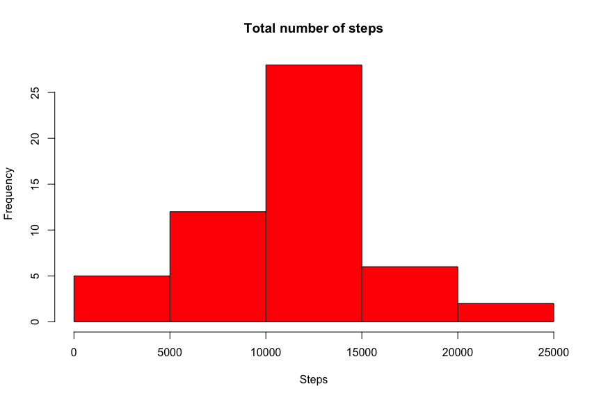
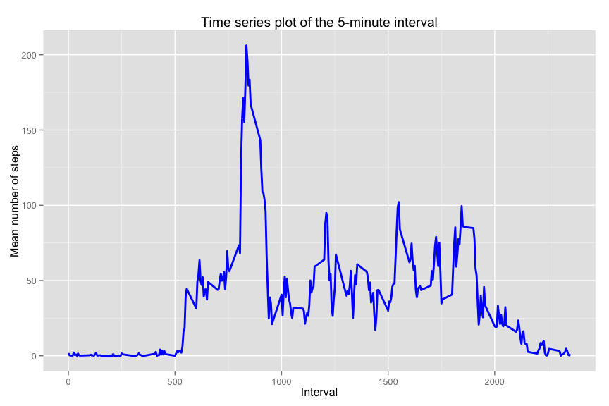
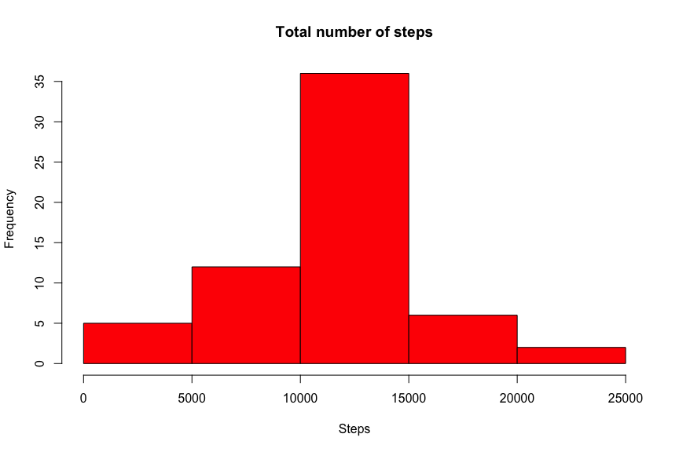
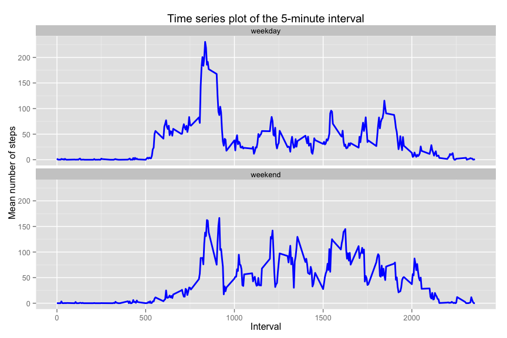

# Peer Assessment 1
Mark Konakov  
### 1. Loading and preprocessing the data

```r
# Set working directory
setwd("./RR_Peer_Assessment_1")
library(dplyr)
library(ggplot2)
```


```r
# Download and unzip data
url <- "https://d396qusza40orc.cloudfront.net/repdata%2Fdata%2Factivity.zip"
download.file(url, destfile="./Activity_data.zip",method="curl")
unzip("Activity_data.zip",exdir="./")

# Load data
data <- read.csv("activity.csv")

# Transform data
date <- as.Date(data$date)
data <- select(data,-2)
activity_data <- mutate(data,date)
```

### 2. What is mean total number of steps taken per day

1. Calculate the total number of steps taken per day


```r
data_1 <-na.omit(activity_data)
data_2 <-group_by(data_1,date)
data_2 <- summarise(data_2,steps=sum(steps))
```

2. Make a histogram of the total number of steps taken each day


```r
hist(data_2$steps, xlab="Steps", main="Total number of steps", col="red")
```

 

3. Calculate and report the mean and median of the total number of steps taken per day


```r
data_3 <- summarise(data_2,steps=mean(steps))
data_4 <- summarise(data_2,steps=median(steps))
report_1 <-cbind(data_3,data_4)
names(report_1) <-c("mean","median")
report_1
```

```
##       mean median
## 1 10766.19  10765
```
### What is the average daily activity pattern

1. Time series plot of the 5-minute interval (x-axis) and the average number of steps taken, averaged across all days (y-axis)


```r
data_5 <- group_by(data_1,interval)
data_5 <- summarise(data_5,steps=mean(steps))
plot <- ggplot(data_5, aes(interval,steps))+geom_line(color="blue",size=1)+labs(x="Interval",y="Mean number of steps",title="Time series plot of the 5-minute interval")
plot
```

 

2. 5-minute interval, on average across all the days in the dataset, contains the maximum number of steps


```r
report_2 <-data_5[data_5$steps==max(data_5$steps),]
report_2
```

```
## Source: local data frame [1 x 2]
## 
##   interval    steps
## 1      835 206.1698
```

### Imputing missing values

1. Calculate and report the total number of missing values in the dataset (i.e. the total number of rows with NAs)

```r
mv <- sum(!complete.cases(activity_data))
mv
```

```
## [1] 2304
```

2. Strategy for filling in all of the missing values in the dataset.

```r
g_data <- group_by(activity_data,interval)
g_data <- summarise(g_data ,steps=round(mean(steps,na.rm=T),0))
m_data <- merge(activity_data,g_data, by="interval")
m_data$steps <-ifelse(is.na(m_data$steps.x), m_data$steps.y, m_data$steps.x) 
head(m_data)
```

```
##   interval steps.x       date steps.y steps
## 1        0      NA 2012-10-01       2     2
## 2        0       0 2012-11-23       2     0
## 3        0       0 2012-10-28       2     0
## 4        0       0 2012-11-06       2     0
## 5        0       0 2012-11-24       2     0
## 6        0       0 2012-11-15       2     0
```

3. Histogram of the total number of steps taken each day  

```r
m_data_g <- group_by(m_data,date)
m_data_s <- summarise(m_data_g,steps=sum(steps))
hist(m_data_s$steps, xlab="Steps", main="Total number of steps", col="red")
```

 


4. Report the mean and median total number of steps taken per day

```r
m_data_mean <- summarise(m_data_s,steps=mean(steps))
m_data_mean
```

```
## Source: local data frame [1 x 1]
## 
##      steps
## 1 10765.64
```

```r
m_data_median <- summarise(m_data_s,steps=median(steps))
m_data_median
```

```
## Source: local data frame [1 x 1]
## 
##   steps
## 1 10762
```
### Differences in activity patterns between weekdays and weekends
1. Create a new factor variable in the dataset with two levels – “weekday” and “weekend” indicating whether a given date is a weekday or weekend day

```r
m_data$days <-sapply(m_data$date,weekdays)
m_data$week <- ifelse(m_data$days == "суббота"|m_data$days=="воскресенье","weekend","weekday")
m_data$week <- as.factor(m_data$week)
head(m_data$week)
```

```
## [1] weekday weekday weekend weekday weekend weekday
## Levels: weekday weekend
```
2. Plot containing a time series plot of the 5-minute interval (x-axis) and the average number of steps taken, averaged across all weekday days or weekend days (y-axis)

```r
m_data_g <- group_by(m_data,interval,week)
m_data_s <- summarise(m_data_g,steps=mean(steps))
plot <- ggplot(m_data_s, aes(interval,steps))+geom_line(color="blue",size=1)+facet_wrap(~week,nrow=2)+labs(x="Interval",y="Mean number of steps",title="Time series plot of the 5-minute interval")
plot
```

 
